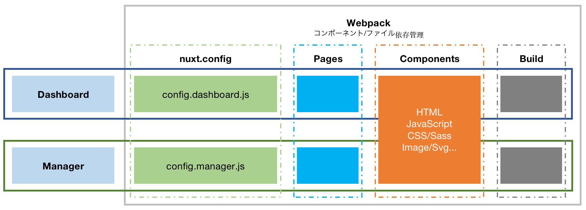

# First Group

> The cars Dashboard and Manager's front-end system.



## Build Setup

#### Setup

```bash
# install dependencies
$ npm install
# or
$ npm i
```

#### Development

update and build first-group-ui

```bash
# /first-group-ui
# https://github.com/monstar-lab-consulting/first-group-ui/tree/develop
# Pull the latest code of the first-group-ui/develop branch
# build
npm run build
```

run first_group(manager or dashboard)

```bash
# serve with hot reload at localhost:3000
# dashboard
$ npm run dashboard
# or
$ npm run dev:d
# manager
$ npm run manager
# or
$ npm run dev:m
```

run ui doc

```bash
$ npm run ui
```

#### Build and Launch server

```bash
# build for production
# dashboard and manager
$ npm run build
# dashboard only
$ npm run build:d
# manager only
$ npm run build:m
#
# launch server dashboard, at localhost:3000
$ npm run start:d
# launch server manager, at localhost:3001
$ npm run start:m
```

## nuxt.config

/build/config.dashboard.js

```javascript
import { baseConfig } from './base'

export default {
  ...baseConfig,
  dir: {
    pages: 'pages/dashboard',
  },
  // https://nuxtjs.org/api/configuration-generate
  generate: {
    dir: 'dist/dashboard',
  },
  plugins: [
    ...baseConfig.plugins,
    { src: '~/plugins/global-dashboard-properties.js', ssr: false },
  ],
}
```

/build/config.manager.js

```javascript
import { baseConfig } from './base'

export default {
  ...baseConfig,
  dir: {
    pages: 'pages/manager',
  },
  // https://nuxtjs.org/api/configuration-generate
  generate: {
    dir: 'dist/manager',
  },
  plugins: [
    ...baseConfig.plugins,
    { src: '~/plugins/global-manager-properties.js', ssr: false },
  ],
}
```

#### Dirctory

/build

```
# base config
base.js
# dashbaord config
config.dashboard.js
# manager config
config.manager.js
```

## Global properties

It's a custom global property of Vue

#### Properties

| property    | type    | remark                                                      |
| :---------- | :------ | :---------------------------------------------------------- |
| \$isManager | Boolean | front system environment differentiation, `true` or `false` |

#### Source

/plugins/global-manager-properties.js

```javascript
import Vue from 'vue'

const extendsProps = {
  install(Vue) {
    Vue.prototype.$isManager = true
  },
}

Vue.use(extendsProps)
```

#### Usage

```javascript
export default {
  data() {
    return {
      isManager: this.$isManager,
    }
  },
}
```

## Documents

#### Nuxt.js

https://nuxtjs.org/

#### Vuetifyjs

https://vuetifyjs.com/en/components/api-explorer/

#### Chart.js

https://www.chartjs.org/docs/latest/

#### Webpack

https://webpack.js.org/

For detailed explanation on how things work, check out [Nuxt.js docs](https://nuxtjs.org).
