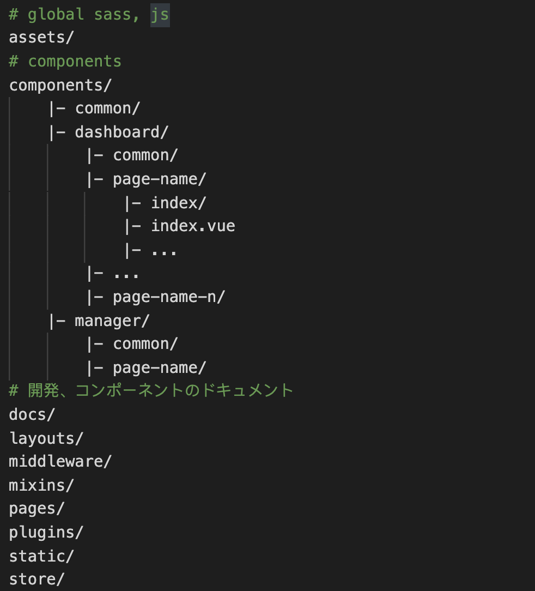
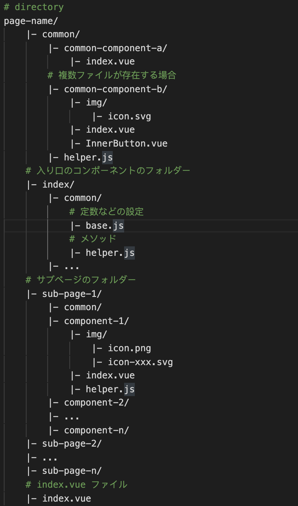

# File and Directory

* 名前付け

* nuxt/static コンポーネントのファイル入り禁止 https://nuxtjs.org/guides/directory-structure/static

## 名前付け

英字小文字（`a-z`）、アラビア数字（`0-9`）、ハイフン（`-`）に限定する

|名称|表記例|説明|用途|
|:--|:--|:--|:--|
|ケバブケース|チェインケース|kebab-case|文字の単語間にハイフン|

### File and Directory

```bash
# file
icon-arrow.svg
# directory
static/img/default-avatar.jpg
message-edit-dialog/index.vue
```

### 特例 Component

React/Vue Component (パスカルケース)

> コンポーネントは実際にはコンストラクタ（constructor）である

```bash
# react component
/ReactComponent.jsx
# vue component
/VueComponent.vue
```

## フォルダーの構築

> Convention over configuration

> [設定より規約](https://ja.wikipedia.org/wiki/%E8%A8%AD%E5%AE%9A%E3%82%88%E3%82%8A%E8%A6%8F%E7%B4%84)

nuxt



```bash
# global sass, js
assets/
# components
components/
    |- common/
    |- dashboard/
        |- common/
        |- page-name/
            |- index/
            |- index.vue
            |- ...
        |- ...
        |- page-name-n/
    |- manager/
        |- common/
        |- page-name/
# 開発、コンポーネントのドキュメント
docs/
layouts/
middleware/
mixins/
pages/
plugins/
static/
store/
```

components



```bash
# directory
page-name/
    |- common/
        |- common-component-a/
            |- index.vue
        # 複数ファイルが存在する場合
        |- common-component-b/
            |- img/
                |- icon.svg
            |- index.vue
            |- InnerButton.vue    
        |- helper.js
    # 入り口のコンポーネントのフォルダー
    |- index/
        |- common/
            # 定数などの設定
            |- base.js
            # メソッド
            |- helper.js
        |- ...
    # サブページのフォルダー
    |- sub-page-1/
        |- common/
        |- component-1/
            |- img/
                |- icon.png
                |- icon-xxx.svg
            |- index.vue
            |- helper.js
        |- component-2/
        |- ...
        |- component-n/
    |- sub-page-2/
    |- ...
    |- sub-page-n/
    # index.vue ファイル
    |- index.vue
```

最小単位のコンポーネント

```bash
/user-edit-dialog
    |- /img
        |- icon.svg
        |- bg.png
        |- bg@2x.png
    |- index.vue
    |- ChildComponent.vue
```

#### 該当コンポーネントは他のコンポーネントのファイル(static、imgなどのファイル)を使用とした場合、

そのファイルを該当コンポーネントにコピーしで下さい、webpackのfile-loaderに任せて処理する

https://webpack.js.org/loaders/file-loader/#root